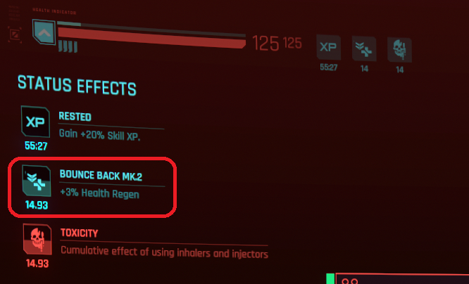

# Mod mechanics

```admonish warning title="Spoiler alert!"
The following description details **every feature** of this mod, which will ruin any surprise intended to be discovered and enjoyed by the player.

This is only for people who can't stand playing a mod without knowing each of their internal gameplay mechanics. 🫣

You've been warned !
```

```admonish info title="A note of caution too"
Please note the gameplay below might evolve over time, as more content get released.

Since it has to be manually maintained and it can happen that I forgot to do it (*I'm a mere human after all choom's, not some methodic borg*), please let me know in the [Github issues](https://github.com/cyb3rpsych0s1s/4ddicted/issues) if ever something is outdated.
```

## Systems

This mod add the following gameplay systems to the game.

### Addiction

The way addiction is being kept track of is the following:

- whenever V consumes an addictive consumables (see which ones below),
his/her addiction to this specific consumable increases (you can think of it as a jauge).
- whenever V rests at home for long enough, gets refreshed, his/her addictions jauges decrease.
- mild drugs decreases twice as fast as they increase.
- hard drugs increases twice as fast as they decrease.

Addiction jauge has the following thresholds:

- `Clean` (never consumed, or withdrawn from for long enough)
- `Barely` (consumed a couple of times)
- `Mildly` (consumed frequently, but not too much)
- `Notably` (consumed on a regular basis, or the substance is very addictive in itself)
- `Severely` (consumed for way too long)

V is considered seriously addict whenever (s)he reaches `notable` or `severe` thresholds.

Of course (s)he can perfectly withdraw from consuming the addictive substance and, if long enough, his/her threshold will decrease back.

🆕 >= v1.0.0

- Consumables addictive potency now increases on subsequent consumption(s) the same day. (thanks [Phoenicia][Phoenicia])
  > which means, the more you consume daily the faster it increases.
- Consumables addictive resilience now increases when severing consumption for multiple subsequent days. (thanks [Phoenicia][Phoenicia])
  > which means, the longer you prevent from consuming the faster it weans off.
- Compatible with [Survival System][Survival System]: being overly stressed prevents addiction from weaning off when sleeping.

### Addictive consumables

#### Symptoms

The player will get hints from V whenever (s)he gets seriously addict:

- inhalers will make V cough, slightly after inhaling.
- injectors will make V feel pain, once their effect wears off.
- pills will have a specific effect on consumption, depending on their kind:
  - anabolics (Stamina Booster, Carry Capacity Booster) will make V grunts.
  - neuro transmitter (RAM Jolt) will make V experience migraine.

🆕 >= beta-0.13.0

These hints slightly increase foes' audio stim range while playing, making V more likely to be detected.

#### Families

Consumables are grouped by family, which gets their own gameplay mechanics.

##### Healers

- consumables: MaxDOC, BounceBack and Health Booster.
- healers are considered as mild drugs.

Whenever V becomes notably addict to any healer, the benefits of the consumables decrease. If (s)he is severely addict, the benefits gets even more lessened.

> e.g. if [MaxDOC](https://cyberpunk.fandom.com/wiki/MaxDoc) usually instantly restores 40% health, whenever notably addict it will only restore 30%, or 20% if severely addict. For some healers, it also lasts shorter.

The status effects of these consumables will also have their UI in radial wheel updated accordingly, with their own custom icon.

🆕 >= beta-0.13.0

- V will start consuming healers faster when reaching severe addiction threshold.



##### Stimulants

- consumables: RAM Jolt, Stamina Booster and Carry Capacity Booster.
- stimulants are considered as mild drugs.

Whenever V becomes notably addict to a booster (each being treated separately)
and (s)he hasn't consumed any for a certain duration, (s)he gets a debuff equals to what the consumable originally grants.

> e.g. if [RAM Jolt](https://cyberpunk.fandom.com/wiki/RAM_Jolt) increases max RAM units by 2, whenever V is withdrawing (s)he is at 90% memory if notably addict, or 70% memory if severely addict until (s)he consumes some again.

Craving for a stimulant will also be shown in radial wheel with custom icon.

🆕 >= beta-0.13.0

- RAM Jolt can also cause Photosensitivity when severely withdrawn, which make impairing blinding effects (e.g. flash grenades) last longer.

🆕 >= v1.0.0

- Stamina Booster can also cause Lesions, which make force-opening any door or hard-landing cause damages.

##### Black Lace

Black Lace has always been an iconic drug in Cyberpunk lore, hence why it gets its own system.

Black Lace is considered as a hard drug.

Whenever V becomes notably or severely addict to Black Lace,
and (s)he hasn't consumed any for a certain duration (s)he is susceptible to Fibromalgya, a custom status effect which decreases his/her REF

> e.g. when experiencing Fibromalgya, V's REF decreases to 90% if notably addict or 70% if severely addict, until (s)he consumes some again.

When suffering from Fibromalgya, V will also express some pain.

Craving for Black Lace will also be shown in radial wheel with custom icon.

##### Alcohols

Alcohols are considered hard drug.

🆕 >= beta-0.13.0

Whenever V becomes notably or severely alcoholic (s)he can be subject to Jitters, greatly impairing his/her ability at aiming with ranged weapons.

> Compatible with [Idle Anywhere][Idle Anywhere] and [Immersive Bartenders][Immersive Bartenders].

##### Cigars and cigarettes

🆕 >= beta-0.13.0

Whenever V becomes notably or severely addict to tobacco (s)he can be subject:

- Short breath (notably addict): delays + reduces Stamina regeneration, and consumes Stamina while sprinting.
- Breathless (severely addict): delays + reduces Stamina regeneration, and consumes Stamina both while sprinting and dodging.

> Compatible with [Idle Anywhere][Idle Anywhere].

---

🆕 >= beta-0.9.0

Additional mechanisms now exists to account for players using [Wannabe Edgerunner][Wannabe Edgerunner] mod together.

###### Insanity

Whenever addicted to Black Lace, V can suffer an additional `Humanity` penalty, called Insanity.
Penalty is calculated from max number of consecutive consumptions, along with addiction threshold.

###### Neuroblockers

Neuroblockers addiction works a little bit like Healers, except that it weakens their duration.
In short: the more you're addicted to Neuroblockers, the shorter they last.

The status effects of these consumables will also have their UI in radial wheel updated accordingly, with their own custom icon.

🆕 >= v1.0.0

- Neuroblockers usage is contraindicated with neuro-stimuli intensive cyberwares like ExDisk and BioConductor, as it tends to accelerate the addiction process.

---

### Cyberware

Some cyberwares also have an impact on addiction in general.

#### Detoxifier

This item makes V's addictions decrease drastically more whenever getting a proper rest.

> e.g. whenever equipped with Detoxifier and properly resting at house, V sees his/her addiction decrease twice as fast (cumulable with Metabolic Editor).

⚠️ >= CDPR patches `2.0+` apparently removed Detoxifier so gameplay mechanics might be obsolete, unless used with [SynthDose][SynthDose]?

This benefit is kept hidden from the player to discover.

#### Metabolic Editor

This item makes V's addictions decrease drastically more whenever getting a proper rest.

> e.g. whenever equipped with Metabolic Editor and properly resting at house, V sees his/her addiction decrease thrice as fast (cumulable with Detoxifier).

This benefit is kept hidden from the player to discover.

⚠️ >= CDPR patches `2.0+` apparently removed Metabolic Editor so gameplay mechanics might be obsolete, unless used with [Pre 2.0 Legendary Cyberware Collection][Pre 2.0 Legendary Cyberware Collection]?

#### Biomonitor

This item will warn V whenever crossing a serious thresholds.

> e.g. a little animation will play on-screen with the Biomonitor warning V about his/her current condition.

The UI is also dismissable, and automatically hides whenever interacting with another interaction UI in the game.


#### Drug Pump

🆕 >= v1.0.0

A secret piece of cyberware called Drug Pump is available to find in-game.

This street-modified blood pump accelerates its possessor's healing while spiking their bloodstream with Black Lace. The injection has a tier-based percentage chance to consume the item.

(thanks [Demon9ne][Demon9ne])

### Voiced reactions

🆕 >= beta-0.8.0

Now V will sometimes have voiced reactions, for English language only (it will have no effect for people playing  in another language yet).

Examples:

- whenever biomonitor boots many times.
- whenever biomonitor reports serious condition multiple times.
- whenever biomonitor is dismissed during combat.

Some of these voiced reactions are unique.

> Requires [Audioware][Audioware].

### Caution notices

🆕 >= v1.0.0

Consumable tooltips in backpack now display caution notices from their manufacturer regarding their responsible usage.

[Audioware]: https://www.nexusmods.com/cyberpunk2077/mods/12001
[Idle Anywhere]: https://www.nexusmods.com/cyberpunk2077/mods/8038
[Immersive Bartenders]: https://www.nexusmods.com/cyberpunk2077/mods/10372
[Pre 2.0 Legendary Cyberware Collection]: https://www.nexusmods.com/cyberpunk2077/mods/21914
[Survival System]: https://www.nexusmods.com/cyberpunk2077/mods/7510
[SynthDose]: https://www.nexusmods.com/cyberpunk2077/mods/14094
[Wannabe Edgerunner]: https://www.nexusmods.com/cyberpunk2077/mods/5646
[Demon9ne]: https://next.nexusmods.com/profile/Demon9ne/mods
[Phoenicia]: https://next.nexusmods.com/profile/Phoenicia4/mods
