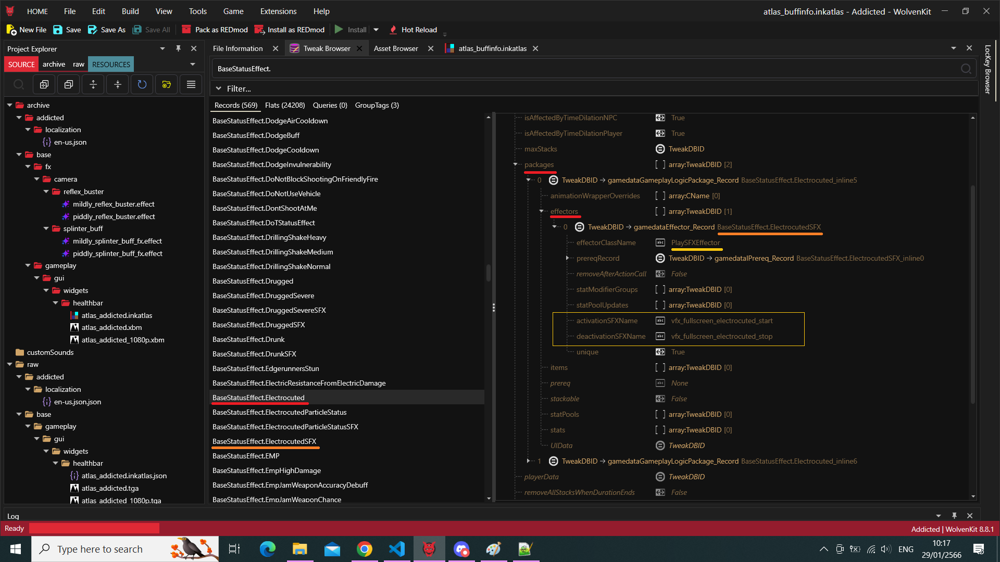

# Effectors

Or simply put, adding custom logic at runtime to statically defined status effects.

Looking at `BaseStatusEffect.BerserkPlayer` in WolvenKit,
in its 2nd `packages` then down in its `effectors`'' first entry,
there's a `BaseStatusEffect.BerserkPlayerSFXEffector` whose `effectorClassName` is `PlaySFXEffector`.

Looking into game sources, there's indeed a `PlaySFXEffector` (which extends `Effector`/`IScriptable`),
which allows for tweaking e.g. the effect at runtime based on conditions:

```swift
public class PlaySFXEffector extends Effector {
  // ...
  protected func ActionOn(owner: ref<GameObject>) -> Void {
    this.m_owner = owner;
    if !this.m_startOnUninitialize && IsNameValid(this.activationSFXName) {
      if !this.m_unique {
        GameObject.PlaySound(this.m_owner, this.activationSFXName, n"PlaySFXEffector");
      } else {
        GameObject.PlaySoundWithParams(this.m_owner, this.activationSFXName, n"PlaySFXEffector", audioAudioEventFlags.Unique);
      };
    };
  }
}
```

Here's another example with similarly designed status effect, `ElectrocutedSFX`, in WolvenKit:



```admonish info
Some experiments can be found in the [travelog entry from 2023-02-10](./../travelog/2023-02-10.md).
```
