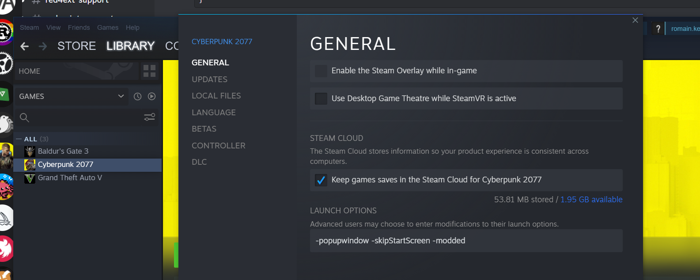

# customSounds

Custom sounds can be added to the game with REDmod.

- unrelated to **Pack as REDmod** or **Pack**, both works
  > .archive and customSounds are distinct
- if mod was both **Pack**ed and **Packed as REDmod**,
  files under `archive/pc/mod` (ArchiveXL) takes precedence over files in `mods` (REDmod).
  
- must be copied over into:
  - `{install}/mods/{my-mod}/customSounds` (all your .wav)
  - `{install}/mods/{my-mod}/info.json`
- requires run `deploy` on REDmod cli whenever changed
  REDmod cli can be found in game's files `{install}/tools/redmod/bin/redMod.exe`
  (see `deploy` command in justfile)
- requires game settings: `-modded`
  

### encoding

.wav works in 44100Hz 16bits mono (pcm_s16le in ffmpeg).

🆕 actually I made a further experiment using ww2ogg and ffprobe to extract the infos from vanilla audio files.
vanilla .wav suggests `48000Hz` 16bits mono.

<details><summary>analyze with ffprobe</summary>

```sh
$ just analyze C:\\Development\\modding-cyberpunk\\4ddicted\\archive\\source\\archive\\base\\localization\\common\\vo\\civ_mid_m_85_mex_30_mt_vista_del_rey_f_1ed3f72f92559000.wem

ffprobe -i 'C:\Development\modding-cyberpunk\4ddicted\archive\source\archive\base\localization\common\vo\civ_mid_m_85_mex_30_mt_vista_del_rey_f_1ed3f72f92559000.wem' -show_format

ffprobe version 6.0-essentials_build-www.gyan.dev Copyright (c) 2007-2023 the FFmpeg developers
  built with gcc 12.2.0 (Rev10, Built by MSYS2 project)
  configuration: --enable-gpl --enable-version3 --enable-static --disable-w32threads --disable-autodetect --enable-fontconfig --enable-iconv --enable-gnutls --enable-libxml2 --enable-gmp --enable-lzma --enable-zlib --enable-libsrt --enable-libssh --enable-libzmq --enable-avisynth --enable-sdl2 --enable-libwebp --enable-libx264 --enable-libx265 --enable-libxvid --enable-libaom --enable-libopenjpeg --enable-libvpx --enable-libass --enable-libfreetype --enable-libfribidi --enable-libvidstab --enable-libvmaf --enable-libzimg --enable-amf --enable-cuda-llvm --enable-cuvid --enable-ffnvcodec --enable-nvdec --enable-nvenc --enable-d3d11va --enable-dxva2 --enable-libmfx --enable-libgme --enable-libopenmpt --enable-libopencore-amrwb --enable-libmp3lame --enable-libtheora --enable-libvo-amrwbenc --enable-libgsm --enable-libopencore-amrnb --enable-libopus --enable-libspeex --enable-libvorbis --enable-librubberband
  libavutil      58.  2.100 / 58.  2.100
  libavcodec     60.  3.100 / 60.  3.100
  libavformat    60.  3.100 / 60.  3.100
  libavdevice    60.  1.100 / 60.  1.100
  libavfilter     9.  3.100 /  9.  3.100
  libswscale      7.  1.100 /  7.  1.100
  libswresample   4. 10.100 /  4. 10.100
  libpostproc    57.  1.100 / 57.  1.100

[wav @ 0000023cb642ebc0] Estimating duration from bitrate, this may be inaccurate
[wav @ 0000023cb642ebc0] Could not find codec parameters for stream 0 (Audio: none ([255][255][0][0] / 0xFFFF), 48000 Hz, 
1 channels, 103 kb/s): unknown codec
Consider increasing the value for the 'analyzeduration' (0) and 'probesize' (5000000) options
Input #0, wav, from 'C:\Development\modding-cyberpunk\4ddicted\archive\source\archive\base\localization\common\vo\civ_mid_m_85_mex_30_mt_vista_del_rey_f_1ed3f72f92559000.wem':
  Duration: 00:00:05.94, bitrate: 103 kb/s
  Stream #0:0: Audio: none ([255][255][0][0] / 0xFFFF), 48000 Hz, 1 channels, 103 kb/s
Unsupported codec with id 0 for input stream 0
[FORMAT]
filename=C:\Development\modding-cyberpunk\4ddicted\archive\source\archive\base\localization\common\vo\civ_mid_m_85_mex_30_mt_vista_del_rey_f_1ed3f72f92559000.wem
nb_streams=1
nb_programs=0
format_name=wav
format_long_name=WAV / WAVE (Waveform Audio)
start_time=N/A
duration=5.937938
size=76925
bit_rate=103638
probe_score=99
[/FORMAT]
```

</details>

### packaging

it's perfectly fine to **Pack** normally in WolvenKit,
while still using REDmod for custom sounds on the side.

The following warnings on **Pack** .archive can safely be ignored. REDmod will still load the custom sounds if found in the game files, as previously mentioned.


### translations

files in `customSounds` can perfectly be nested in subdirectories,
allowing (separate mods included) to prepare voices for translations,
under e.g. `en-us/`.

### localization

[Codeware](https://github.com/psiberx/cp2077-codeware) also provides
[LocalizationSystem](https://github.com/psiberx/cp2077-codeware/wiki/#localization)
to easily handle translations of any kind: voice, subtitle, etc.

> credits to people at Discord, especially @Manually Enhanced Fuzzo, @IslandDancer
>
> credits to @bespokecomp on Github
