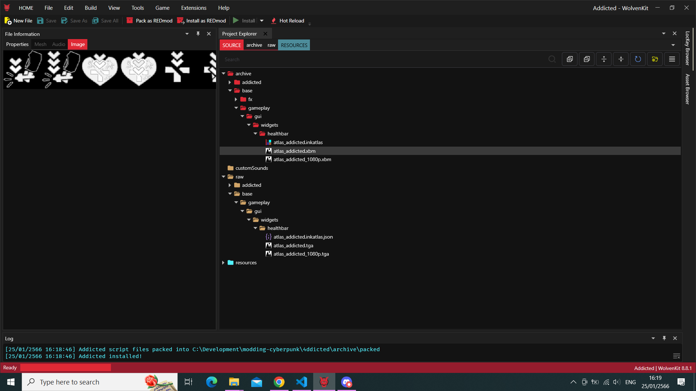

# Blog

## 2023/01/25

### Status effects icons research follow-up

#### Tooling update

So it turns out I had to fork and modify [InkAtlas Utils](deadlymustard/inkatlas-utils).

The JSON format for the *.inkatlas* file, a.k.a `WKitJsonVersion` has changed (now in `0.0.3`).
Also, as a side note:

- the TGA gets flipped horizontally while it does seem to be the case in WKit anymore.
  > just manually flip it vertically in Photoshop
- the `atlasPartName` normalizing function doesn't replace the `-` with `_` as assumed.
  > just manually search and replace the atlasPartName in IDE
- the `ArchiveFileName` isn't set in the `Header`.
  > just copy/paste absolute location of the *.inkatlas* file

#### More troubleshooting

Given a repo like this:


Also, in TweakXL here's how to correctly define it:

```yaml
UIIcon.NotablyWeakenedFirstAidWhiff:
  $type: UIIcon_Record
  atlasPartName: notably_first_aid_whiff
  atlasResourcePath: base\gameplay\gui\widgets\healthbar\atlas_addicted.inkatlas

BaseStatusEffect.NotablyWeakenedFirstAidWhiffV0:
  $base: BaseStatusEffect.FirstAidWhiffV0
  uiData:
    $base: BaseStatusEffect.FirstAidWhiffV0_inline4
    iconPath: NotablyWeakenedFirstAidWhiff
```

Thanks to psiberx once again, I completely missed this.
