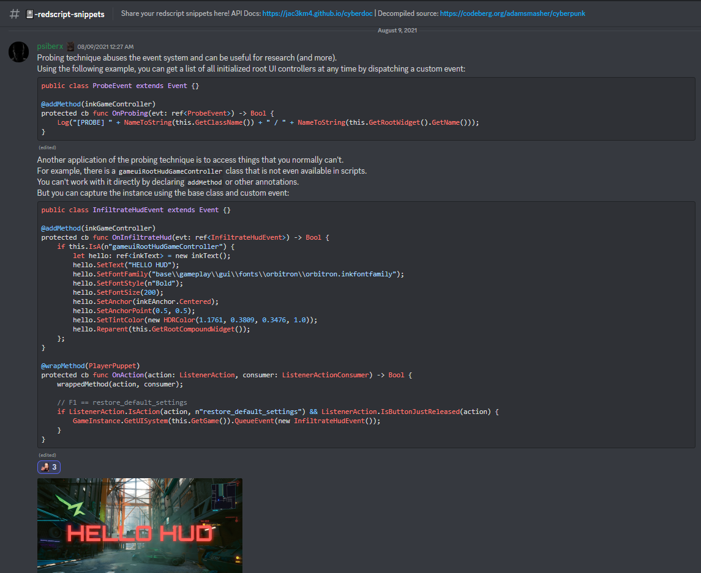

# 2023/01/24

## Status effects icons research

So after having literally flatlined my install once again, here we are:

gathering notes first ...

I was recommended the [WolvenKit guid on Adding new items](https://wiki.redmodding.org/cyberpunk-2077-modding/modding-guides/items/adding-new-items).

Probably need to be extra careful on [hooking up the inkatlas](https://wiki.redmodding.org/cyberpunk-2077-modding/modding-guides/items/adding-new-items#hooking-up-the-inkatlas).

There's also a notable entry in [TweakXL item icons](https://github.com/psiberx/cp2077-tweak-xl/wiki/YAML-Tweaks#item-icons).

psiberx on discord:

```swift
@wrapMethod(buffListItemLogicController)
public final func SetData(icon: CName, time: Float) -> Void {
  wrappedMethod(icon, time);
  if Equals(icon, n"first_aid_whiff") {
    inkImageRef.SetAtlasResource(this.m_icon, r"base\\gameplay\\gui\\widgets\\healthbar\\atlas_buffinfo.inkatlas");
    inkImageRef.SetTexturePart(this.m_icon, n"first_aid_whiff");
  };
}
```

but it was also stated elsewhere:

```yaml
HUDWeaponIcons.Satara:
    $type: UIIcon # UIIcon_Record ?
    atlasPartName: 27_Rostovic_DB_2_Satara
    atlasResourcePath: base\gameplay\gui\widgets\ammo_counter\atlas_ammo_counter.inkatlas
```

### Other interesting things spotted along the way

custom central HUD



## Credits

- Paperclip
- psiberx

## Troubleshooting

### Size

- original size:  640x512
- 1080p:          320x256
- 720p:           216x152

note:

- width   1080p -> 720p: `320 / 80 * 54 = 216`  (not the same ratio)
- height  1080p -> 720p: `256 / 64 * 38 = 152`  (not the same ratio)

based on width:

- 216/8       = 27
- 640/8       = 80
- 27/80       = 0.3375
- 640*0.3375  = 216
- or 640/100*33.75
