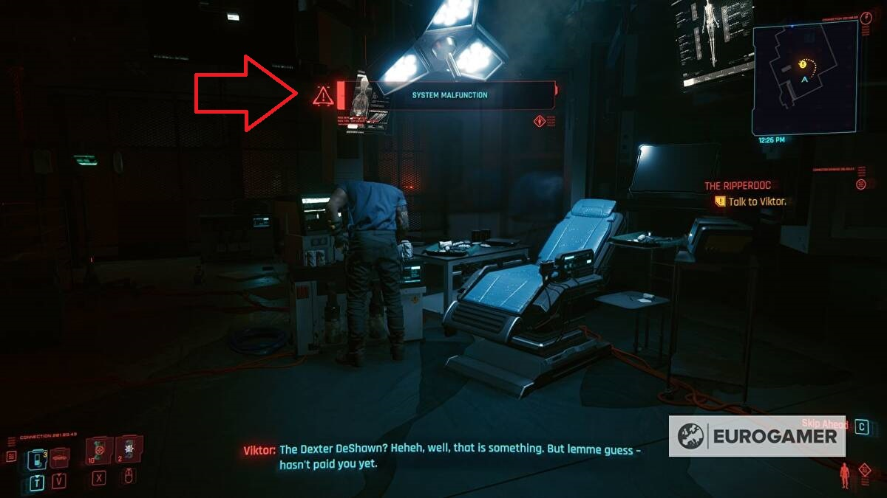
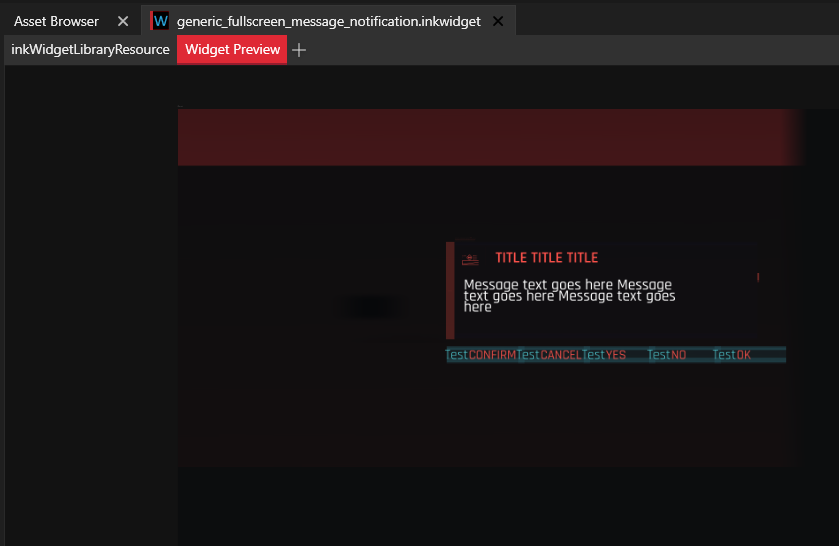
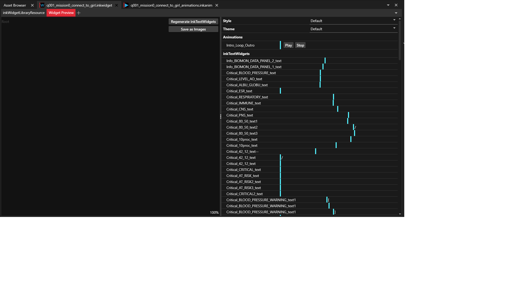

# 2023-01-30

## Blackboard internals

Trying to demystify about `IBlackboard` so-called `DelayedListener`, and here's what people taught me:

### credits to psiberx

you register a listener (delayed or not)
the listener is fired when:

- value has changed with `Set`*()
- value is set and unchanged but `force` parameter is true
- `Signal`*() called explicitly

delayed listener is just called later, in the other part of the cycle.

### Mixing listeners, events and callbacks

But internal mechanics are different from `IBlackboard`, as stated by psiberx.

### as a courtesy of Technic235

```swift
@wrapMethod(ArcadeMachine)
protected func StartGlitching(glitchState:EGlitchState, opt intensity:Float) -> Void {
  if Equals(this.m_controllerTypeName, n"ArcadeMachineController") {
    this.EVMSetupArcadeStaticGlitchListener();
  };
}

@addMethod(InteractiveDevice)
protected func EVMSetupArcadeStaticGlitchListener() -> Void {
  let devicePS = this.GetDevicePS();
  if devicePS.evmArcadeStaticEventID == 0u {
    let evt = new EVMArcadeStaticGlitchEvent();
    let delay: GameTime = GameTime.MakeGameTime(0, 0, 0, RandRange(120, 301)); // days, hours, opt minutes, opt seconds
    devicePS.evmArcadeStaticEventID = GameInstance.GetTimeSystem(devicePS.GetGameInstance()).RegisterDelayedListener(this, evt, delay, -1);
  };
}

public class EVMArcadeStaticGlitchEvent extends Event {
  // intentionally empty
}

@addMethod(ArcadeMachine)
protected cb func OnEVMArcadeStaticGlitchEvent(evt:ref<EVMArcadeStaticGlitchEvent>) {
  let delaySystem = GameInstance.GetDelaySystem(this.GetGame());
  let callback = new EVMDelayArcadeStaticGlitchCallback();
  callback.machine = this;
  delaySystem.DelayCallback(callback, RandRangeF(0, 10), true); // randomize start times
}

class EVMDelayArcadeStaticGlitchCallback extends DelayCallback {
  let machine: ref<ArcadeMachine>;
  protected func Call() -> Void {
    this.machine.EVMStartArcadeStaticGlitch();
  }
}

@addMethod(ArcadeMachine)
protected func EVMStartArcadeStaticGlitch() {
  if !this.evmSparkActive {
    GameObjectEffectHelper.ActivateEffectAction(this, gamedataFxActionType.Start, n"hack_fx");
    let delaySystem = GameInstance.GetDelaySystem(this.GetGame());
    let callback = new EVMArcadeStaticGlitchCompletedCallback();
    callback.machine = this;
    delaySystem.DelayCallback(callback, 13, true);
    this.evmSparkActive = true;
  };
}

class EVMArcadeStaticGlitchCompletedCallback extends DelayCallback {
  let machine: ref<ArcadeMachine>;
  protected func Call() -> Void {
    this.machine.evmSparkActive = false;
  }
}
```

## Research on UI

Next step is to give a better look-and-feel to current addiction-related notifications.
So far, I've used SimpleScreenMessage which works just fine
but is used mostly for Relic malfunction / Network breach notification.


A way better look-and-feel / lore-friendly UI would probably be this one:


So let's browse WolvenKit Asset browser and find out where it's at:

a couple interesting ones found while searching:

- activity_log.inkwidget
  
- generic_fullscreen_message_notification.inkwidget
  

finally found out:

- q001_mission0_connect_to_girl.inkwidget
  
- q001_wakeup_biomoncheck.inkwidget
  

Then, where is it used in the code ?

Well haha, trickier.

- no relevant reference to `q001`
- points at `DeviceBase`
- open many rabbit holes

So maybe `inkWidgetLibraryResource` from WKit ?

Hey, results seem much better !

- `gameuiTooltipsManager`
- `ATooltipData`
- `InteractionsHubGameController`

Also, DJ_Kovrik to the rescue:


Which also brought me to:



My guess so far is that the closest `inkGameController` to what I need is the [inkHUDGameController](https://jac3km4.github.io/cyberdoc/#34400),
except that I'll need only one `inkAnimProxy`, the one returned from calling [PlayLibraryAnimation](https://jac3km4.github.io/cyberdoc/#18366).

But turns out it wasn't the full solution, see the [follow-up](2023-01-31.md).
