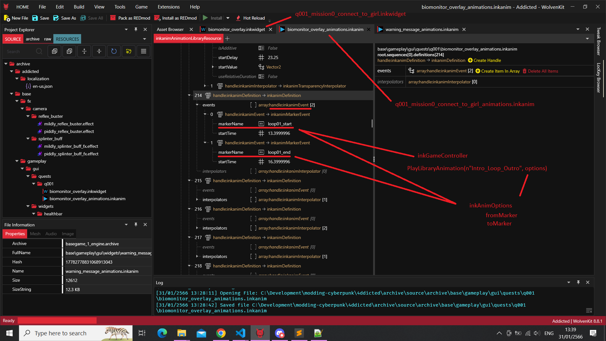

# 2023-01-31

## Research on UI: follow-up

So after many failed [attempts](2023-01-30.md), here's the complete solution:

First it happens that *q001_mission0_connect_to_girl.inkwidget* and its counterpart *q001_mission0_connect_to_girl_animations.inkanim* actually contains markers. These markers are named timeframes, useful to play only part(s) of the whole sequence.

Of course the *.inkwidget* contains the graphic UI component, like in a web frontend. The *.inkanim* contains 2 arrays fields containing:

- in `definitions`: the effects (or interpolations) to play
- in `targets`: the path to a nested child in the widget tree
  > literally the path: [0,1,0,7] would be the child at index 0, his child at index 1, so on and so forth...

These arrays both match: the engine probably apply to `target` the `definition` of the interpolations, one after another till done.

It can be verified by exporting the *.inkanim* to JSON and searching for `markerName`.
Here's how it looks like in WolvenKit:



But for this particular anim, there's only 2 markers: `loop01_start` and `loop01_end`,
which I assume correspond to the moment where it loops while the game wait for the player to choose his/her next action.


Well, a solution is again to clone the *.inkwidget* and *.inkanim* files, and rename them to one's liking.

Then, the trick is to export *.inkanim* to JSON, open it in your favorite IDE, copy entry with the `markerName`, paste it at the end of the array and edit it by adding as many marker names and start time as needed. Once done, don't forget to convert from JSON back.

But both arrays `definitions` and `targets` sizes have to match: go to `target`, copy the entry at the **same index** as in `definitions` and paste it at the end of array using the same process as previously.


```swift
// or import cp2077-codeware library instead
// required for compilation
@addField(inkWidget)
native let parentWidget: wref<inkWidget>;

// Spawn the widget on load
@wrapMethod(NameplateVisualsLogicController)
protected cb func OnInitialize() -> Bool {
    wrappedMethod();
    let root = this.GetRootCompoundWidget().parentWidget.parentWidget.parentWidget;
    // this line takes care of instantiating our inkWidget and attach it our inkGameController below
    this.SpawnFromExternal(root, r"base\\gameplay\\gui\\quests\\q001\\biomonitor_overlay.inkwidget", n"Root:MyController");
}

// Custom controller with your logic
public class MyController extends inkGameController {
    protected cb func OnInitialize() {
        // conveniently, PlayLibraryAnimation accepts an optional inkAnimOptions
        let options: inkAnimOptions;
        // with properties like fromMarker, toMarker, and more
        options.toMarker = n"loading_end"; // my custom marker

        let root: ref<inkCompoundWidget> = this.GetRootWidget() as inkCompoundWidget;
        let panel = root.GetWidget(n"main_canvas/Booting_Info_Critica_Mask_Canvas/Booting_Info_Critical_Canvas/Booting_Screen/BIOMONITOR_DATA_PANEL_text") as inkText;
        let booting = root.GetWidget(n"main_canvas/Booting_Info_Critica_Mask_Canvas/Booting_Info_Critical_Canvas/Booting_Screen/BOOTING_Text") as inkText;

        panel.SetText("HELLO WORLD");
        booting.SetText("HELLO WORLD");
        
        // custom .inkAnim name to target our modified version with custom markers
        this.PlayLibraryAnimation(n"Biomonitor_Overlay_Intro_Loop_Outro", options);
    }
}
```

and boom !


Nice :)

Some additional informations in [follow-up](./2023-02-03.md).

### credits

- `psiberx`
- `DJ_Kovrik`
