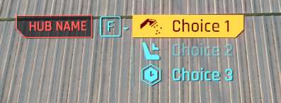

# 2023-02-10

## Play successive sounds directly defined with TweakXL

Let's imagine we want a migraine status effect which would last for 15 minutes, while playing a looping SFX for the first 10 seconds, then a fade out SFX for the next 25 seconds and stop. Here's how to quickly roll it:

credits to RMK on Discord for pointing out `Prereqs.DurationPrereq` !

```yml
# this effector kicks in first and play first sound
Effectors.MigraineStart:
  $type: Effector_Record
  effectorClassName: PlaySFXEffector
  activationSFXName: q101_sc_03_heart_loop

# 10 seconds after, this effector switch first sound being played for second one
Effectors.MigraineDecrease:
  $type: Effector_Record
  effectorClassName: StopAndPlaySFXEffector
  sfxToStop: q101_sc_03_heart_loop
  sfxToStart: q004_sc_04a_heartbeat_rev
  prereqRecord:
    $base: Prereqs.DurationPrereq
    duration: 10
    randRange: 0

# 25 seconds after, this effector stop second sound
Effectors.MigraineEnd:
  $type: Effector_Record
  effectorClassName: StopSFXEffector
  sfxName: q004_sc_04a_heartbeat_rev
  prereqRecord:
    $base: Prereqs.DurationPrereq
    duration: 25
    randRange: 0

# effect last for 15 minutes (900 seconds)
BaseStatusEffect.Migraine:
  $type: StatusEffect_Record
  duration:
    $type: StatModifierGroup_Record
    drawBasedOnStatType: false
    statModifiers:
      - $type: ConstantStatModifier_Record
        modifierType: Additive
        statType: BaseStats.MaxDuration
        value: 900
    statModsLimit: -1
    statModsLimitModifier: None
  packages:
    - $type: GameplayLogicPackage_Record
      stats:
        - $type: ConstantStatModifier_Record
          modifierType: Multiplier
          statType: BaseStats.Memory
          value: 0.7
    - $type: GameplayLogicPackage_Record
      effectors: [Effectors.MigraineStart, Effectors.MigraineDecrease, Effectors.MigraineEnd]
  uiData:
    $base: UIData.WithdrawnFromMemoryBooster
    intValues: [70]
```

## Create interaction for biomonitor dismissal

All credits to: keanuWheeze on Discord

Create simple interaction:

```lua
local function createInteraction(action, title)
    local choiceData =  InteractionChoiceData.new()
    choiceData.localizedName = title
    choiceData.inputAction = action

    local choiceType = ChoiceTypeWrapper.new()
    choiceData.type = choiceType

    return choiceData
end

local function createInteractionHub()
    local choiceHubData =  InteractionChoiceHubData.new()
    choiceHubData.id = -1001
    choiceHubData.active = true
    choiceHubData.flags = EVisualizerDefinitionFlags.Undefined
    choiceHubData.title = 'Test Interaction Hub'

    local choices = {}
    table.insert(choices, createInteraction('Choice1', 'Blow up the sky'))
    choiceHubData.choices = choices

    return choiceHubData
end

local function prepareVisualizersInfo(hub)
    local visualizersInfo = VisualizersInfo.new()
    visualizersInfo.activeVisId = hub.id
    visualizersInfo.visIds = { hub.id }
    
    return visualizersInfo
end

registerHotkey('TestInteractions', 'TestInteractions', function()
    local interactionHub = createInteractionHub()
    local visualizersInfo = prepareVisualizersInfo(interactionHub)
    
    local blackboardDefs = Game.GetAllBlackboardDefs()
    local interactionBB = Game.GetBlackboardSystem():Get(blackboardDefs.UIInteractions)

    interactionBB:SetVariant(blackboardDefs.UIInteractions.InteractionChoiceHub, ToVariant(interactionHub), true)
    interactionBB:SetVariant(blackboardDefs.UIInteractions.VisualizersInfo, ToVariant(visualizersInfo), true)
end)
```

Create proper dialog interaction:

```lua
local interactionUI = require("interactionUI")

registerForEvent("onInit", function()
    interactionUI.init()
end)

registerForEvent("onUpdate", function()
    interactionUI.update()
end)

registerHotkey("customDialog", "Show Dialog", function()
    -- Setup choices
    local choice1 = interactionUI.createChoice("Choice 1", TweakDBInterface.GetChoiceCaptionIconPartRecord("ChoiceCaptionParts.ShowerIcon"), gameinteractionsChoiceType.QuestImportant) -- Icon and choiceType are optional
    local choice2 = interactionUI.createChoice("Choice 2", TweakDBInterface.GetChoiceCaptionIconPartRecord("ChoiceCaptionParts.SitIcon"), gameinteractionsChoiceType.AlreadyRead)
    local choice3 = interactionUI.createChoice("Choice 3", TweakDBInterface.GetChoiceCaptionIconPartRecord("ChoiceCaptionParts.WaitIcon"), gameinteractionsChoiceType.Selected)
    -- Setup, set and show hub
    local hub = interactionUI.createHub("Hub Name", {choice1, choice2, choice3}) -- Create hub and give it the list of choices
    interactionUI.setupHub(hub) -- Set the hub
    interactionUI.showHub() -- Show the previously set hub

    -- Setup callbacks
    interactionUI.callbacks[1] = function()
        print("Choice 1 used")
    end
    interactionUI.callbacks[2] = function()
        print("Choice 2 used")
    end
    interactionUI.callbacks[3] = function()
        print("Choice 3 used")
        interactionUI.hideHub() -- Hide the dialog
    end
end)
```


