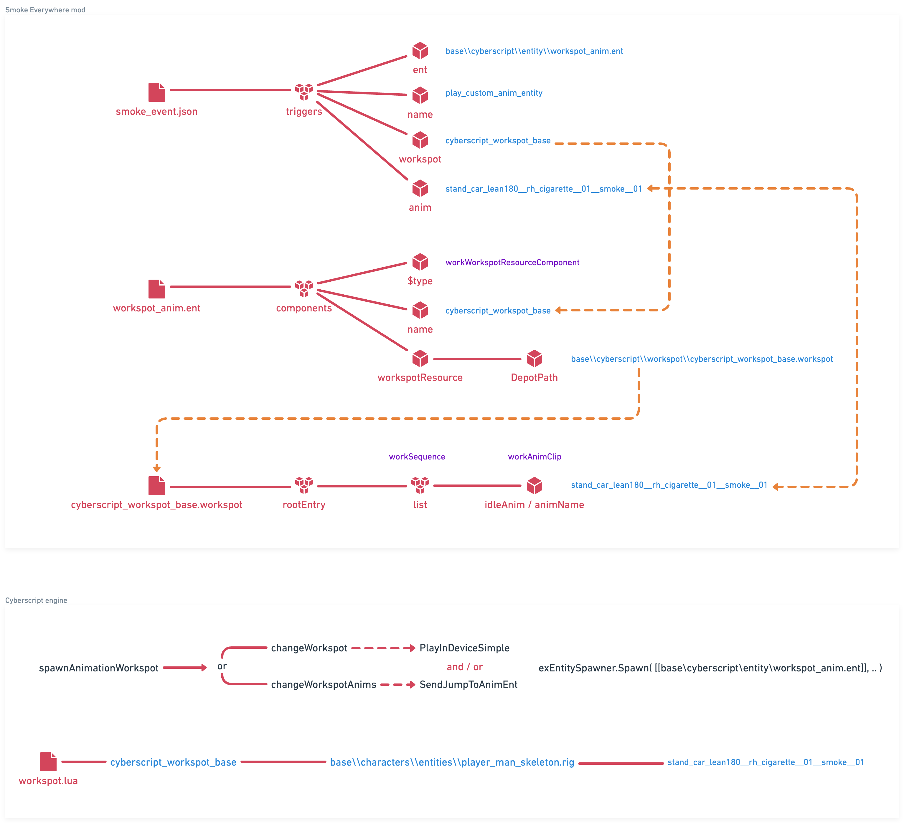

# understanding entity and workspot

For a while I've tried to play animation on V to add some interesting gameplay mechanic for Addicted.
But I never quite understood them, until today.

A couple of weeks ago I had a talk with @Eli and @donk7413, the authors of [Cyberscript](https://www.nexusmods.com/cyberpunk2077/mods/6475) and the [Smoke Everywhere](https://www.nexusmods.com/cyberpunk2077/mods/7768) mods.

When asked about how they managed to do it and which animation name I should use, they mentioned having merged all `.workspot` files in a gigantic file for convenience (namely [Cyberscript Core Animation Archive](https://www.nexusmods.com/cyberpunk2077/mods/7691)), so that `Cyberscript` can play any animation in-game on V or any NPC.

At first it didn't ring a bell, but then @psiberx mentioned about modders "abusing" `.workspot` by spawning an invisible `.ent` to have the target being animated.

I gave a couple of tries with latest Codeware pre-release (which introduces [DynamicEntitySystem](https://github.com/psiberx/cp2077-codeware/wiki#spawning-entities) allowing to spawn `.ent` at runtime, among others) a couple of days ago unsuccessfully.

Finally today I sat, examined `.ent` and `.workspot` in `WolvenKit` from both `Cyberscript Core Animation Archive` and `Smoke Everywhere` and start seeing a pattern that I had seen in other files previously, but didn't paid attention at that time.

## clearing misconceptions

Actually the ones I personally had before:

- `.ent` can be anything, not just a "living entity".
  it can be a cigarette, the act of smoking.. it can really be "whatever".
  - it contains `components` with e.g. `workspotMapper`, `entSlot`, etc
  - it also contains obviously a `workWorkspotResourceComponent` with points out to the `.workspot`.
- `.workspot` gets triggered throughout `.ent`: _you don't spawn a workspot and play it on a target_, you spawn an entity which references the workspot and plays the workspot through the entity (which in turn play the animation(s), and you can "jump" from one animation to another in the same workspot).

I managed to reproduce `Smoke Everywhere` in `.reds` piece by piece.

Next step will be to progressively clear up `components` one-by-one to check which one(s) are actually required or not.

## credits

All credits to @Eli and @donk7413 on [REDmodding Discord](https://discord.gg/redmodding).
Also @psiberx for always providing hints that lead me back on tracks.
